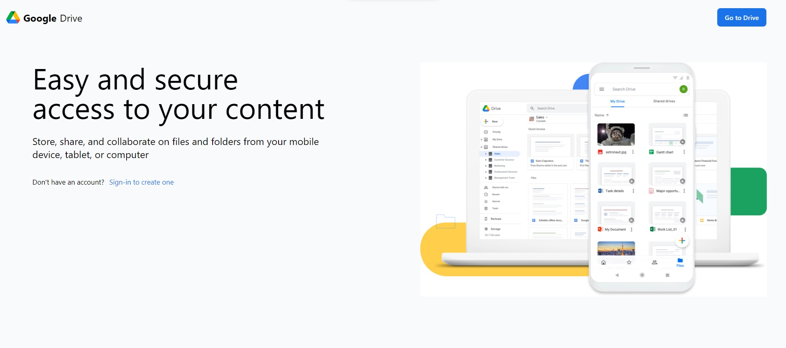
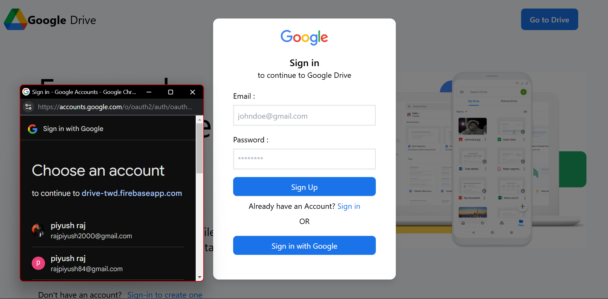
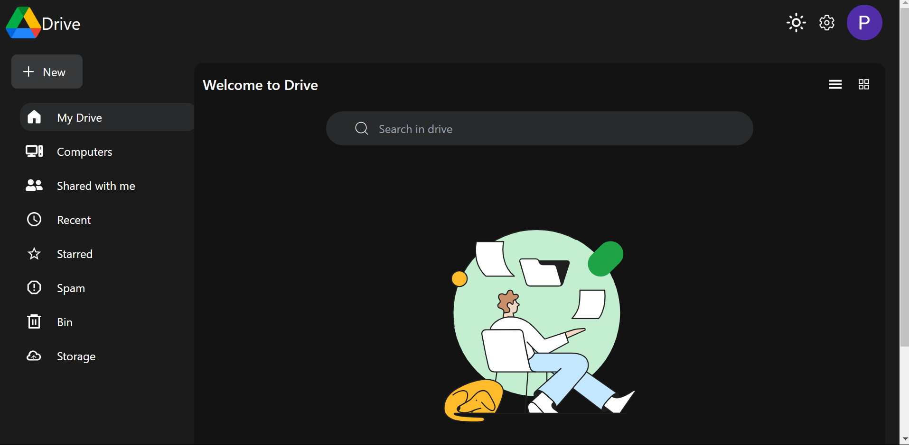
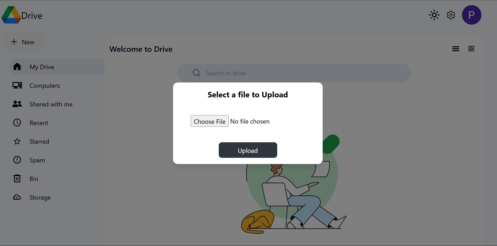

# Google Drive Clone 📂

## Overview

Welcome to the **Google Drive Clone** project! 🎉 This app is a fully functional replica of Google Drive, built with React and Firebase. With it, you can sign up, log in, upload files, and organize them into folders—just like the real deal!

## ✨ Features

- 🔐 **User Authentication**: Sign up, log in, and log out effortlessly with Firebase Authentication.
- 📄 **Real-time Database**: Store and retrieve your files instantly using Firebase Firestore.
- 📤 **File Upload**: Upload your files securely with Firebase Storage. //not working (no free storage service given by google)
- 🗂️ **Organize Files**: Create folders to keep your files neatly organized.
- 📱 **Responsive Design**: Enjoy a seamless experience on mobile, tablet, and desktop.
- 🌗 **Dark and Light Mode**: Switch between dark and light modes to suit your preference.
- 🗃️ **Sidebar Navigation**: Navigate easily with a sidebar that includes starred items, trash, shared with me, and storage space indicators.

## 🛠️ Technologies Used

- ⚛️ **React**: For building the user interface.
- 🔥 **Firebase**: For authentication, database storage, and file storage.
- 🚦 **React Router**: For navigation.
- 🎨 **Tailwind CSS**: For styling.

## 🔧 Prerequisites

Before you start, make sure you have the following:

- 🌐 **Node.js and npm**: Installed on your machine.
- 🔥 **Firebase Project**: Set up a Firebase project in the Firebase Console.

## 🚀 Getting Started

Follow these steps to get the project running on your local machine:

1. **Clone the repository**:
    ```plaintext
    git clone https://github.com/yourusername/google-drive-clone.git
    cd google-drive-clone
    ```

2. **Install dependencies**:
    ```plaintext
    npm install
    ```

3. **Set up Firebase**:
    - Create a Firebase project at [Firebase Console](https://console.firebase.google.com/).
    - Add a web app to your Firebase project and get the Firebase configuration object.
    - Enable Email/Password and Google authentication in the Firebase Authentication section.
    - Create Firestore and Storage rules to allow authenticated users.

4. **Add Firebase configuration**:
    - Create a `.env` file in the root directory and add your Firebase configuration:
    ```plaintext
    VITE_FIREBASE_API_KEY=your_api_key
    VITE_FIREBASE_AUTH_DOMAIN=your_auth_domain
    VITE_FIREBASE_PROJECT_ID=your_project_id
    VITE_FIREBASE_STORAGE_BUCKET=your_storage_bucket
    VITE_FIREBASE_MESSAGING_SENDER_ID=your_messaging_sender_id
    VITE_FIREBASE_APP_ID=your_app_id
    ```

5. **Start the development server**:
    ```plaintext
    npm run dev
    ```

## 📸 Screenshots


### Sign In Page


### Login with Firebase


### Dark Mode


### File Upload


## 🤝 Contributing

We welcome contributions, issues, and feature requests! Check out the [issues page](https://github.com/yourusername/google-drive-clone/issues).

## 🙌 Acknowledgments

- Inspired by the original [Google Drive](https://drive.google.com/).

---

Feel free to reach out if you have any questions. Enjoy using your Google Drive Clone! 📂🚀
